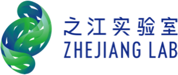

I work at [Zhejiang Lab, AI Team](https://www.zhejianglab.com/)  as a senior engineer now in Hangzhou, leading a AI research group. 

I am now working on Multi-modal(view) Learning, Information Retrieval, and Pattern Recognition. If you are seeking any form of **academic cooperation**, please feel free to email me at [qijian.zhu@outlook.com](mailto:qijian.zhu@outlook.com).

I am pursuing a doctoral degree at the School of Information Science and Technology, University of Science and Technology of China. My doctoral supervisor is [Prof. DAI lirong (戴礼荣)](https://faculty.ustc.edu.cn/dailirong/en/jsxx/242724/jsxx/).

My research interest includes Multi-modal(view) Learning, Information Retrieval, Pattern Recognition. I have published 5+ papers  at the top international AI conferences such as ICME, APWEB-WAIM. 

I had been working at Alibaba Cloud for 6 years, working in algorithms for natural language processing.
My hobbies are basketball, football, and music.

# 🔥 News
- *2023.11*: 🎉 One paper is accepted by Information Fusion(中科院一区, TOP, IF 18.6)
- *2023.08*: 🔥 We release [CLIPMH](https://github.com/HackerHyper/CLIPMH) (⭐️40+)
- *2023.07*: 🎉 One paper ([DFMVH](https://github.com/HackerHyper/DMMVH)) is accepted by ICKG 2023
- *2023.05*: 🎉 One paper ([CSMVH]() is accepted by AWEB-WAIM 2023
- *2023.03*: 🎉 One paper ([DMMVH](https://github.com/HackerHyper/DMMVH)) is accepted by ICME 2023

# 📝 Publications 
## 🎙 Multi-modal Learning

- ``Information Fusion`` [Fast Metric Multi-View Hashing for Multimedia Retrieval](https://www.sciencedirect.com/science/article/pii/S1566253523004463), **Jian Zhu**, Pengbo Hu, Bingqian Li, Yi Zhou (JCR Q1)

- ``ICME 2023`` [Deep Metric Multi-View Hashing for Multimedia Retrieval](https://ieeexplore.ieee.org/abstract/document/10219985), **Jian Zhu**, Xiaohu Ruan, Yongli Cheng, Zhangmin Huang, Yu Cui, Lingfang Zeng (CCF Rank B)

- ``APWEB-WAIM 2023`` [Central Similarity Multi-View Hashing for Multimedia Retrieval](https://arxiv.org/abs/2308.13774), **Jian Zhu**, Wen Cheng, Yu Cui, Chang Tang, Yuyang Dai, Yong Li, Lingfang Zeng (CCF Rank C)

- ``ICKG 2023`` [Deep Fusion Multi-View Hashing for Multimedia Retrieval](https://ieeexplore.ieee.org/abstract/document/10219985), **Jian Zhu**, Xiaohu Ruan, Yongli Cheng, Zhangmin Huang, Yu Cui, Lingfang Zeng (EI)

# 🎖 Honors and Awards
- *2009.10* National Scholarship (Undergraduate) (Top 1%)

# 📖 Educations
- *2023.09 - 2027.06*, P.h.D, University of Science and Technology of China, Hefei.
- *2012.09 - 2015.06*, Postgraduate, University of Science and Technology of China, Hefei.
- *2006.09 - 2010.06*, Undergraduate, Hefei University of Technology, Hefei.

# 💬 Invited Talks
- *2023.10*, Apweb-waim 2023 \| [\[Video\]](https://www.bilibili.com/video/BV12N4y1U7sB/?vd_source=9d142474d02f0acf222ae9fa865073c1)

# 💻 Internships
- *2013.09 - 2014.09*, [iFLYTEK CO.LTD.](https://www.iflytek.com/), Hefei.

<!---
MingkaiSheng/MingkaiSheng is a ✨ special ✨ repository because its `README.md` (this file) appears on your GitHub profile.
You can click the Preview link to take a look at your changes.
--->
